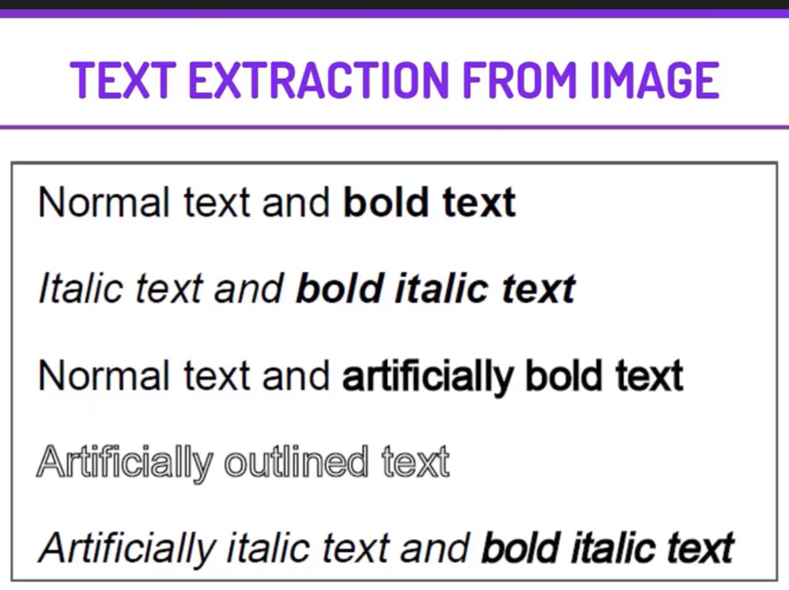

  
 

<i>
  <h2> <i> Text Extraction from Image </i> </h2>

<i> IN THIS PROJECT, WE WILL BE WORKING ON EXTRACTING TEXT FROM IMAGES. AFTER EXTRACTING THE TEXT WE WILL APPLY SOME BASIC FUNCTIONS OF OPENCV ON THAT TEXT TO ENHANCE IT AND TO GET MORE ACCURATE RESULTS. THIS PROJECT WILL BE VERY USEFUL AS IT WILL SAVE TIME AND EFFORT OF TYPING FROM AN IMAGE.

 
  
  <h2> <i>Image Classification </i> </h2>

<i>Image classification refers to the task of extracting information classes from a multiband raster image Depending on the interaction between the analyst and the computer during classification, there are two types of classification: supervised and unsupervised We will be working with supervised image classification

 

  <h2> The Steps to solve the problem </h2>

1. DOWNLOADING TESSERACT AND INSTALL IT WITH OTHER DEPENDENCIES  
2. LOADING THE IMAGE FOR TEXT EXTRACTION, RESIZING IT, AND THEN SAVE IT.  
3. USING PYTESSERACT TO EXTRACT THE TEXT FROM THE IMAGE.  
4. PROCESSING THE TEXT EXTRACTED FROM THE IMAGE.  
5. USING COMPUTER VISION FOR FURTHER PROCESSING OF COMPLEX IMAGES  
6. REMOVING NOISE FROM THE IMAGE USING THE BLUR FUNCTION  
7. PERFORM THRESHOLD TRANSFORMATION OF THE IMAGE.  
8. USING ERODE FUNCTION OF CV2 ON IMAGE  
9. PERFORMING SOME OTHER IMAGE PROCESSING OPERATIONS.  
10. DRAWING RECTANGLES AROUND A CHARACTER AND A PARTICULAR PATTERN/WORD. 

  
  

<i>Different organizations can use this to extract useful information from the image and store it. Individuals can use it for saving their time and effort for typing. It will ease the burden of document analysis and understanding them. It will reduce man work and revolutionize the system by automating the OCR method for text extraction. 

     
  
  <h2> <i>Flask Web App  </i> </h2>

<i>SThis is the second part where we build the web application using the framework Flask We mount the model we build in the previous part on the Flask project

     
  
  
  <h1> Screenshots </h1>
  <h2> Input Screen </h2>
 

  
    
  
<h2> Output Screen </h2> 

   
    

### Give It a Star if you liked the project 
